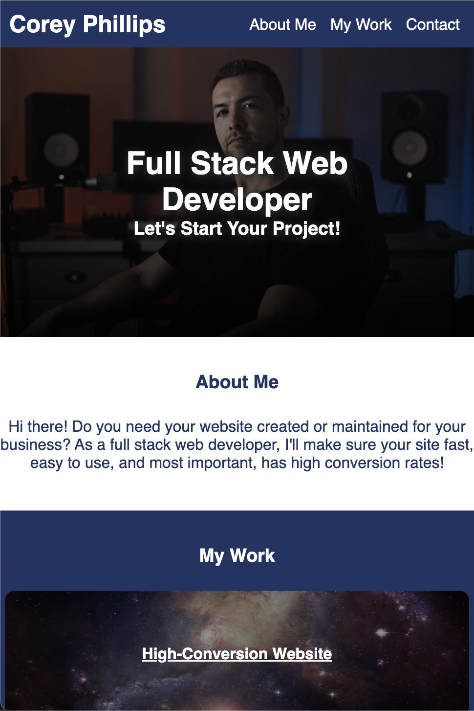
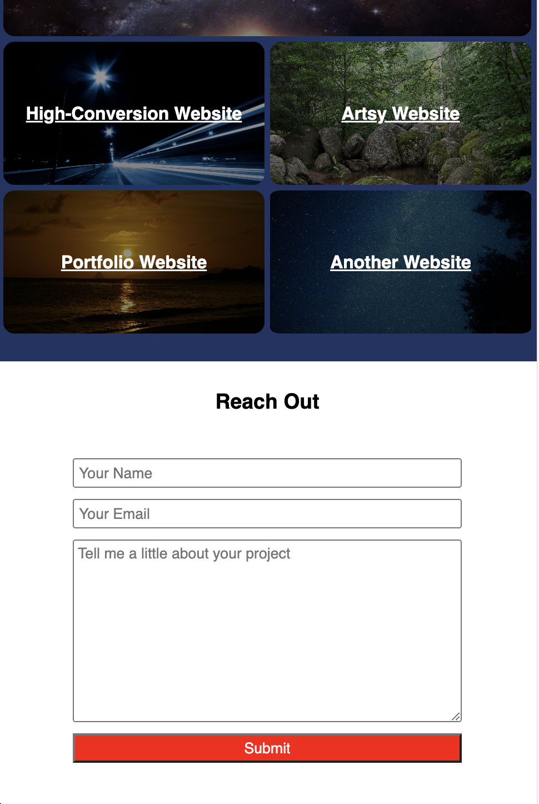
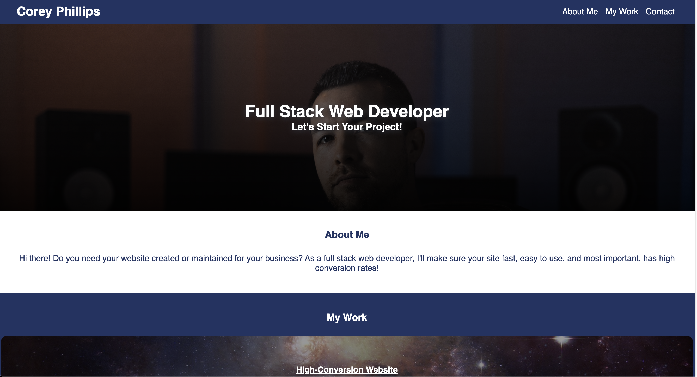

# my_portfolio_web_application

## This is a web application I created using HTML and CSS. It's purpose is to showcase my work as a web developer. Included is a picture of me, a brief bio, and five links to my work. 

## Installation

N/A

## Usage

This is a basic website with five external links, showcasing previous work I've done as a web developer. The project was used for learning advanced CSS techniques.

## Credits

N/A

## License

Please refer to the LICENSE in the repo.
